# NSX-T 2.5.1 Manual Installation

## Overview

The following installation guide documents the implementation of a functional NSX-T 2.5.1 Installation. This implementation uses variables that function in the TKGI-Ninja lab environment, using the TKGI-Ninja-Baseline template. Anyone is welcome to build a similar lab environment and follow along with the lab exercises, but please note you will need to replace any variables such as IP addresses and FQDNs and replace them with the appropriate values for your lab environment.

The steps provided in this lab guide are intended for a lab implementation and do not necessarily align with best practices for production implementiations. While the instructions provided in this lab guide did work for the author in their lab environment, VMware and/or any contributors to this Guide provide no assurance, warranty or support for any content provided in this guide.

## Prerequisites

- VMware Employees can access a pre-built lab environment aligned with this guide by searching for quick demo on workspace one and selecting the TGKI-Ninja-Baseline Template

## Installation Notes

Anyone who implements any software used in this lab must provide their own licensing and ensure that their use of all software is in accordance with the software's licensing. This guide provides no access to any software licenses.

For those needing access to VMware licensing for lab and educational purposes, we recommend contacting your VMware account team. Also, the [VMware User Group's VMUG Advantage Program](https://www.vmug.com/Join/VMUG-Advantage-Membership) provides a low-cost method of gaining access to VMware licenses for evaluation purposes.

This lab follows the standard documentation, which includes additional details and explanations: [NSX-T 2.5 Installation Guide](https://docs.vmware.com/en/VMware-NSX-T-Data-Center/2.5/installation/GUID-3E0C4CEC-D593-4395-84C4-150CD6285963.html)

### Overview of Tasks Covered in Lab 1

- [NSX-T 2.5.1 Manual Installation](#nsx-t-251-manual-installation)
  - [Overview](#overview)
  - [Prerequisites](#prerequisites)
  - [Installation Notes](#installation-notes)
    - [Overview of Tasks Covered in Lab 1](#overview-of-tasks-covered-in-lab-1)
  - [Step 1:  Deploy NSXT Manager using OVF Install Wizard](#step-1-deploy-nsxt-manager-using-ovf-install-wizard)
      - [1.0 In the Main Console, the vSphere web client is already set up in Chrome. Open up Chrome to get to the vSphere login screen. You can log in using the credentials you were given for the lab,  and you may login by clicking the **Use Windows session authentication** checkbox.](#10-in-the-main-console-the-vsphere-web-client-is-already-set-up-in-chrome-open-up-chrome-to-get-to-the-vsphere-login-screen-you-can-log-in-using-the-credentials-you-were-given-for-the-lab-and-you-may-login-by-clicking-the-use-windows-session-authentication-checkbox)
      - [1.1 In the vSphere client, From the Hosts and Clusters view, right click on the RegionA01-MGMT01 Cluster and select `Deploy OVF Template'](#11-in-the-vsphere-client-from-the-hosts-and-clusters-view-right-click-on-the-regiona01-mgmt01-cluster-and-select-deploy-ovf-template)
      - [1.2 On the `Select an OVF Template` step, select `Local File` and Navigate to the NSXT Manager OVA file, the filename should start with 'nsx-unified-appliance`. In the reference lab, this is located on the 'E:/Downloads' Directory](#12-on-the-select-an-ovf-template-step-select-local-file-and-navigate-to-the-nsxt-manager-ova-file-the-filename-should-start-with-nsx-unified-appliance-in-the-reference-lab-this-is-located-on-the-edownloads-directory)
      - [1.3 On the `Select a name and folder` step, use the name `nsxmgr01a-1` and select `RegionA01` Datacenter as the location](#13-on-the-select-a-name-and-folder-step-use-the-name-nsxmgr01a-1-and-select-regiona01-datacenter-as-the-location)
      - [1.4 On the `Select a compute resource` step, select `RegionA01-MGMT01` and click `Next`](#14-on-the-select-a-compute-resource-step-select-regiona01-mgmt01-and-click-next)
      - [1.5 On the `Review Details` step, verify details and click `Next`](#15-on-the-review-details-step-verify-details-and-click-next)
      - [1.6 On the `Configuration` step, select a `Small` Configuration and click `Next`](#16-on-the-configuration-step-select-a-small-configuration-and-click-next)
      - [1.7 On the `Select Storage` step, **first** select the `RegionA01-ISCSI02-COMP01` datastore and then set the virtual disk format to `Thin Provision`.](#17-on-the-select-storage-step-first-select-the-regiona01-iscsi02-comp01-datastore-and-then-set-the-virtual-disk-format-to-thin-provision)
      - [1.8 On the `Select Networks` step, set the Destination Network to `VM-RegionA01-vDS-MGMT` and click `Next`](#18-on-the-select-networks-step-set-the-destination-network-to-vm-regiona01-vds-mgmt-and-click-next)
      - [1.9 On the `Customize Template` step, enter the following variables:](#19-on-the-customize-template-step-enter-the-following-variables)
      - [1.10 On the Ready to Complete screen, click `Finish` to complete the Deploy OVF Template Wizard](#110-on-the-ready-to-complete-screen-click-finish-to-complete-the-deploy-ovf-template-wizard)
      - [1.11 In the vSphere web client go to the task console and verify that the Status for Deploy OVF Template is "Completed" before proceeding](#111-in-the-vsphere-web-client-go-to-the-task-console-and-verify-that-the-status-for-deploy-ovf-template-is-%22completed%22-before-proceeding)
      - [1.12 In the vSphere web client power on the nsxmgr01a-1 VM, you can proceed to the next step while waiting for NSX Manager to boot up](#112-in-the-vsphere-web-client-power-on-the-nsxmgr01a-1-vm-you-can-proceed-to-the-next-step-while-waiting-for-nsx-manager-to-boot-up)
      - [1.13 From the control center desktop, click the windows start button, in the search field type `DNS` and click on `DNS` as shown in the screenshot below](#113-from-the-control-center-desktop-click-the-windows-start-button-in-the-search-field-type-dns-and-click-on-dns-as-shown-in-the-screenshot-below)
      - [1.14 In DNS Manager, in the navigation tree, expand `ControlCenter.corp.local`, then expand `Forward Lookup Zones`, left click to select `corp.local`, and then right click on `corp.local` and select `New Host (A or AAAA)...`](#114-in-dns-manager-in-the-navigation-tree-expand-controlcentercorplocal-then-expand-forward-lookup-zones-left-click-to-select-corplocal-and-then-right-click-on-corplocal-and-select-new-host-a-or-aaaa)
      - [1.15 In the `New Host` window, enter the following values:](#115-in-the-new-host-window-enter-the-following-values)
      - [1.16 Open a web browser connection to NSX Manager, for example:](#116-open-a-web-browser-connection-to-nsx-manager-for-example)
      - [1.17 In the NSX Manager UI, click on a blank area of the screen to bypass the `Welcome to NSX-T` splash screen,  navigate to `System > Appliances`. Observe the value for `Virtual IP` is not set, click `Edit`, set the Virtual IP address to `192.168.110.42` and click `Save`](#117-in-the-nsx-manager-ui-click-on-a-blank-area-of-the-screen-to-bypass-the-welcome-to-nsx-t-splash-screen-navigate-to-system--appliances-observe-the-value-for-virtual-ip-is-not-set-click-edit-set-the-virtual-ip-address-to-19216811042-and-click-save)
      - [1.18 In your web browser tab connected to NSX-T Manager, change the URL to https://nsxmgr-01a.corp.local/login.jsp and reconnect to NSX Manager using this new URL.](#118-in-your-web-browser-tab-connected-to-nsx-t-manager-change-the-url-to-httpsnsxmgr-01acorplocalloginjsp-and-reconnect-to-nsx-manager-using-this-new-url)
  - [Step 2: Add NSX Compute Manager](#step-2-add-nsx-compute-manager)
      - [2.1 In your web browser connection to NSX-T Manager, click on the `System` tab and then on the left navigation bar Click `Fabric`, and then click `Compute Managers`](#21-in-your-web-browser-connection-to-nsx-t-manager-click-on-the-system-tab-and-then-on-the-left-navigation-bar-click-fabric-and-then-click-compute-managers)
      - [2.2 Click on **Add** and Configure the New Compute Manager form with following values:](#22-click-on-add-and-configure-the-new-compute-manager-form-with-following-values)
      - [2.3 Verify the Compute Manager is `Registered` and `Up`. If needed, click **Refresh** in the lower-left hand corner to refresh the display.](#23-verify-the-compute-manager-is-registered-and-up-if-needed-click-refresh-in-the-lower-left-hand-corner-to-refresh-the-display)
  - [Step 3: Add an Edge Node, Transport Zones and Uplink Profiles with the NSX-T Guided Preparation Workflow](#step-3-add-an-edge-node-transport-zones-and-uplink-profiles-with-the-nsx-t-guided-preparation-workflow)
      - [3.1 From the NSX-T Manager UI navigate to the `Advanced Networking & Security > Inventory > Groups > IP Pools` page and click `+ADD`](#31-from-the-nsx-t-manager-ui-navigate-to-the-advanced-networking--security--inventory--groups--ip-pools-page-and-click-add)
      - [3.2 On the `Add IP Pool` screen, enter the following values:](#32-on-the-add-ip-pool-screen-enter-the-following-values)
      - [3.3 From NSX-T Manager UI, click on the `System` tab, then click `Get Started` in the left navigation bar, and then click `Setup Transport Nodes`](#33-from-nsx-t-manager-ui-click-on-the-system-tab-then-click-get-started-in-the-left-navigation-bar-and-then-click-setup-transport-nodes)
      - [3.4 On the `Select Node Type` screen, select `NSX Edge VM` and click `Next`](#34-on-the-select-node-type-screen-select-nsx-edge-vm-and-click-next)
      - [3.5 On the `Select NSX Edge` Screen, click `Add New Edge`](#35-on-the-select-nsx-edge-screen-click-add-new-edge)
      - [3.6 Complete the Add Edge VM workflow with the following values:](#36-complete-the-add-edge-vm-workflow-with-the-following-values)
      - [3.7 The Wizard will deploy and attempt to power on the edge VM (This will take several minutes), but it will fail as there is no host with the capacity to run the large edge in the lab.](#37-the-wizard-will-deploy-and-attempt-to-power-on-the-edge-vm-this-will-take-several-minutes-but-it-will-fail-as-there-is-no-host-with-the-capacity-to-run-the-large-edge-in-the-lab)
      - [3.8 Return to the NSX UI and wait for the wizard to recognize the NSX Edge VM. This may take up to ~15 minutes, and you may need to refresh your connection to NSX Manager, if so you can use the same steps as above to get back to the `Setup Transport Nodes ` wizard.](#38-return-to-the-nsx-ui-and-wait-for-the-wizard-to-recognize-the-nsx-edge-vm-this-may-take-up-to-15-minutes-and-you-may-need-to-refresh-your-connection-to-nsx-manager-if-so-you-can-use-the-same-steps-as-above-to-get-back-to-the-setup-transport-nodes-wizard)
      - [3.9 On the `Select Transport Zone East-West` Screen, select `Create Overlay Transport Zone`](#39-on-the-select-transport-zone-east-west-screen-select-create-overlay-transport-zone)
      - [3.10 In the `Add Transport Zone` workflow, enter the following values:](#310-in-the-add-transport-zone-workflow-enter-the-following-values)
      - [3.11 On the `Select Transport Zone East-West` screen, select `overlay-tz` from the `Overlay Transport Zone` pulldown menu and click `Next`](#311-on-the-select-transport-zone-east-west-screen-select-overlay-tz-from-the-overlay-transport-zone-pulldown-menu-and-click-next)
      - [3.12 On the `Select Uplink Profile East-West` screen, click the `Select Uplink Profile` pulldown menu and select the `nsx-edge-single-nic-uplink-profile` and click `Next`](#312-on-the-select-uplink-profile-east-west-screen-click-the-select-uplink-profile-pulldown-menu-and-select-the-nsx-edge-single-nic-uplink-profile-and-click-next)
      - [3.13 On the `Link to Transport Zone East-West` screen for `Assignment IP Address` select `Use IP Pool` and select `tep-ip-pool` and proceed to the next step before clicking next](#313-on-the-link-to-transport-zone-east-west-screen-for-assignment-ip-address-select-use-ip-pool-and-select-tep-ip-pool-and-proceed-to-the-next-step-before-clicking-next)
      - [3.14 On the `Link to Transport Zone East-West` screen in the `NSX Edge NIC Connections` section, set the value for `fp-eth1` to `uplink-1` and click `Next`](#314-on-the-link-to-transport-zone-east-west-screen-in-the-nsx-edge-nic-connections-section-set-the-value-for-fp-eth1-to-uplink-1-and-click-next)
      - [3.15 On the `Select Transport Zone North-South` screen, click `Create VLAN Transport Zone`](#315-on-the-select-transport-zone-north-south-screen-click-create-vlan-transport-zone)
      - [3.16 On the `Add Transport Zone` screen, add a transport zone with the following parameters:](#316-on-the-add-transport-zone-screen-add-a-transport-zone-with-the-following-parameters)
      - [3.17 On the `Select Transport Zone North-South` screen, select `vlan-tz` from the pulldown menu for `VLAN Transport Zone` and click `Next`](#317-on-the-select-transport-zone-north-south-screen-select-vlan-tz-from-the-pulldown-menu-for-vlan-transport-zone-and-click-next)
      - [3.18 On the `Select Uplink Profile North-South` screen, select `nsx-edge-single-nic-uplink-profile` from the `Select Uplink Profile` pulldown menu and click `Next`](#318-on-the-select-uplink-profile-north-south-screen-select-nsx-edge-single-nic-uplink-profile-from-the-select-uplink-profile-pulldown-menu-and-click-next)
      - [3.19 On the `Link To Transport Zone North-South` screen, in the `NSX Edge NIC Connections` section, set the value for `fp-eth0` to `uplink-1` and click `Next`](#319-on-the-link-to-transport-zone-north-south-screen-in-the-nsx-edge-nic-connections-section-set-the-value-for-fp-eth0-to-uplink-1-and-click-next)
      - [3.20 On the `Add To NSX Edge Cluster` screen, select `Add To New NSX Edge Cluster (system created)` field, set the `NSX Edge Cluster Name` value to `edge-cluster-1` and click `Next`](#320-on-the-add-to-nsx-edge-cluster-screen-select-add-to-new-nsx-edge-cluster-system-created-field-set-the-nsx-edge-cluster-name-value-to-edge-cluster-1-and-click-next)
      - [3.21 On the `Review` screen, set the `Transport Node Name` to `edge-tn-1` and click `Finish`](#321-on-the-review-screen-set-the-transport-node-name-to-edge-tn-1-and-click-finish)
      - [3.22 On the `System` tab in NSX Manager UI, In the left navigation bar expand the `Fabric` section and select `Nodes`. Select the `Edge Transport Nodes` tab, verify that `edge-tn-1` has a `Configuration State` of `Success`, a `Node Status` of `Up`, and is a member of `edge-cluster-1`](#322-on-the-system-tab-in-nsx-manager-ui-in-the-left-navigation-bar-expand-the-fabric-section-and-select-nodes-select-the-edge-transport-nodes-tab-verify-that-edge-tn-1-has-a-configuration-state-of-success-a-node-status-of-up-and-is-a-member-of-edge-cluster-1)
      - [3.23 From the control center desktop, click the windows start button, in the search field type `DNS` and click on `DNS` as shown in the screenshot below](#323-from-the-control-center-desktop-click-the-windows-start-button-in-the-search-field-type-dns-and-click-on-dns-as-shown-in-the-screenshot-below)
      - [3.24 In DNS Manager, in the navigation tree, expand `ControlCenter.corp.local`, then expand `Forward Lookup Zones`, left click to select `corp.local`, and then right click on `corp.local` and select `New Host (A or AAAA)...`](#324-in-dns-manager-in-the-navigation-tree-expand-controlcentercorplocal-then-expand-forward-lookup-zones-left-click-to-select-corplocal-and-then-right-click-on-corplocal-and-select-new-host-a-or-aaaa)
      - [3.25 In the `New Host` window, enter the following values:](#325-in-the-new-host-window-enter-the-following-values)
  - [Step 4: Prepare and Configure ESXi Hosts as NSX-T Transport Nodes](#step-4-prepare-and-configure-esxi-hosts-as-nsx-t-transport-nodes)
      - [4.1 From the NSX Manager UI go to the `System > Get Started` page and click `SET UP TRANSPORT NODES`](#41-from-the-nsx-manager-ui-go-to-the-system--get-started-page-and-click-set-up-transport-nodes)
      - [4.2 On the `Select Node Type` screen select `Host Cluster` and click `Next`](#42-on-the-select-node-type-screen-select-host-cluster-and-click-next)
      - [4.3 On the `Select Host Cluster` Screen, set the value for `Host Cluster` to `RegionA01-COMP01`, when you make this selection, the page will prompt you to `Confirm Installation`, click `Install`. Do not proceed until the status in the `NSX` column for `esx-01a`, `esx-02a` and `esx-03a` is `NSX Installed`, and that `NSX Manager Connectivity` is `Up` for each host as shown in the screenshots below.](#43-on-the-select-host-cluster-screen-set-the-value-for-host-cluster-to-regiona01-comp01-when-you-make-this-selection-the-page-will-prompt-you-to-confirm-installation-click-install-do-not-proceed-until-the-status-in-the-nsx-column-for-esx-01a-esx-02a-and-esx-03a-is-nsx-installed-and-that-nsx-manager-connectivity-is-up-for-each-host-as-shown-in-the-screenshots-below)
      - [4.4 On the `Select Transport Zone East-West` screen set the value for `Overlay Transport Zone` to `overlay-tz` and click `Next`](#44-on-the-select-transport-zone-east-west-screen-set-the-value-for-overlay-transport-zone-to-overlay-tz-and-click-next)
      - [4.5 On the `Select Uplink Profile East-West` screen, set the value for `Select Uplink Profile` to `nsx-default-uplink-hostswitch-profile` and click `Next`](#45-on-the-select-uplink-profile-east-west-screen-set-the-value-for-select-uplink-profile-to-nsx-default-uplink-hostswitch-profile-and-click-next)
      - [4.6 On the `Link to Transport Zone East-West` screen, set the value for `Assignment IP Address` to `Use IP Pool` and set the value for `IP Pool` to `tep-ip-pool`, proceed to the next step before clicking next](#46-on-the-link-to-transport-zone-east-west-screen-set-the-value-for-assignment-ip-address-to-use-ip-pool-and-set-the-value-for-ip-pool-to-tep-ip-pool-proceed-to-the-next-step-before-clicking-next)
      - [4.7 On the `Link to Transport Zone East-West` screen, in the `Host NIC Connections` section, set the value for `vmnic1` to `uplink-1` and click `Next`](#47-on-the-link-to-transport-zone-east-west-screen-in-the-host-nic-connections-section-set-the-value-for-vmnic1-to-uplink-1-and-click-next)
      - [4.8 On the `Review` screen, click `Finish`](#48-on-the-review-screen-click-finish)
      - [4.9 From the NSX Manager UI go to the `System > Get Started` page and click `SET UP TRANSPORT NODES`](#49-from-the-nsx-manager-ui-go-to-the-system--get-started-page-and-click-set-up-transport-nodes)
      - [4.10 On the `Select Node Type` screen select `Host Cluster` and click `Next`](#410-on-the-select-node-type-screen-select-host-cluster-and-click-next)
      - [4.11 On the `Select Host Cluster` Screen, set the value for `Host Cluster` to `RegionA01-MGMT01`, when you make this selection, the page will prompt you to `Confirm Installation`, click `Install`. Do not proceed until the status in the `NSX` column for `esx-04a`, `esx-05a` and `esx-06a` is `NSX Installed`, and that `NSX Manager Connectivity` is `Up` for each host as shown in the screenshots below.](#411-on-the-select-host-cluster-screen-set-the-value-for-host-cluster-to-regiona01-mgmt01-when-you-make-this-selection-the-page-will-prompt-you-to-confirm-installation-click-install-do-not-proceed-until-the-status-in-the-nsx-column-for-esx-04a-esx-05a-and-esx-06a-is-nsx-installed-and-that-nsx-manager-connectivity-is-up-for-each-host-as-shown-in-the-screenshots-below)
      - [4.12 On the `Select Transport Zone East-West` screen set the value for `Overlay Transport Zone` to `overlay-tz` and click `Next`](#412-on-the-select-transport-zone-east-west-screen-set-the-value-for-overlay-transport-zone-to-overlay-tz-and-click-next)
      - [4.13 On the `Select Uplink Profile East-West` screen, set the value for `Select Uplink Profile` to `nsx-default-uplink-hostswitch-profile` and click `Next`](#413-on-the-select-uplink-profile-east-west-screen-set-the-value-for-select-uplink-profile-to-nsx-default-uplink-hostswitch-profile-and-click-next)
      - [4.14 On the `Link to Transport Zone East-West` screen, set the value for `Assignment IP Address` to `Use IP Pool` and set the value for `IP Pool` to `tep-ip-pool`](#414-on-the-link-to-transport-zone-east-west-screen-set-the-value-for-assignment-ip-address-to-use-ip-pool-and-set-the-value-for-ip-pool-to-tep-ip-pool)
      - [4.15 On the `Link to Transport Zone East-West` screen, in the `Host NIC Connections` section, set the value for `vmnic1` to `uplink-1` and click `Next`](#415-on-the-link-to-transport-zone-east-west-screen-in-the-host-nic-connections-section-set-the-value-for-vmnic1-to-uplink-1-and-click-next)
      - [4.16 On the `Review` screen, click `Finish`](#416-on-the-review-screen-click-finish)
      - [4.17 On the `System` tab in NSX Manager UI, In the left navigation bar expand the `Fabric` section and select `Nodes`. Select the `Host Transport Nodes` tab, set the `Managed by` field to `vcsa-01a`, expand the `RegionA01-MGMT01` and `RegionA01-COMP01` sections and ensure the `Configuration State` is `Success` and the `Node Status` is `Up` for all of the hosts](#417-on-the-system-tab-in-nsx-manager-ui-in-the-left-navigation-bar-expand-the-fabric-section-and-select-nodes-select-the-host-transport-nodes-tab-set-the-managed-by-field-to-vcsa-01a-expand-the-regiona01-mgmt01-and-regiona01-comp01-sections-and-ensure-the-configuration-state-is-success-and-the-node-status-is-up-for-all-of-the-hosts)
  - [Step 5: Optionally configure NSX Licensing & Password Expiration](#step-5-optionally-configure-nsx-licensing--password-expiration)
      - [5.1 In the NSX-T UI, navigate to `System > Licenses` and click `+ADD`](#51-in-the-nsx-t-ui-navigate-to-system--licenses-and-click-add)
      - [5.2 Enter your license key and click `ADD`](#52-enter-your-license-key-and-click-add)
      - [5.3 From the control center desktop open putty and establish an ssh connection to nsxmgr-01a, login as `root` with the password `VMware1!VMware1!, and enter the following commands:](#53-from-the-control-center-desktop-open-putty-and-establish-an-ssh-connection-to-nsxmgr-01a-login-as-root-with-the-password-vmware1vmware1-and-enter-the-following-commands)

-----------------------

## Step 1:  Deploy NSXT Manager using OVF Install Wizard

Note: Prior to Step 1, you will need to download the NSX-T 2.5.1 Installation Files and binaries. The Installation binaries are not included in the lab, users will need to provide their own access and licensing to download and use NSX-T 2.5.1. 

#### 1.0 In the Main Console, the vSphere web client is already set up in Chrome. Open up Chrome to get to the vSphere login screen. You can log in using the credentials you were given for the lab,  and you may login by clicking the **Use Windows session authentication** checkbox.

#### 1.1 In the vSphere client, From the Hosts and Clusters view, right click on the RegionA01-MGMT01 Cluster and select `Deploy OVF Template'

<Details><Summary>Screenshot 1.1</Summary>
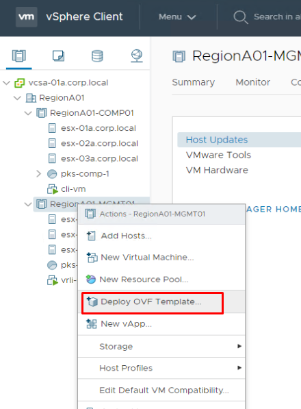
</Details>

#### 1.2 On the `Select an OVF Template` step, select `Local File` and Navigate to the NSXT Manager OVA file, the filename should start with 'nsx-unified-appliance`. In the reference lab, this is located on the 'E:/Downloads' Directory

<details><summary>Screenshot 1.2</summary>
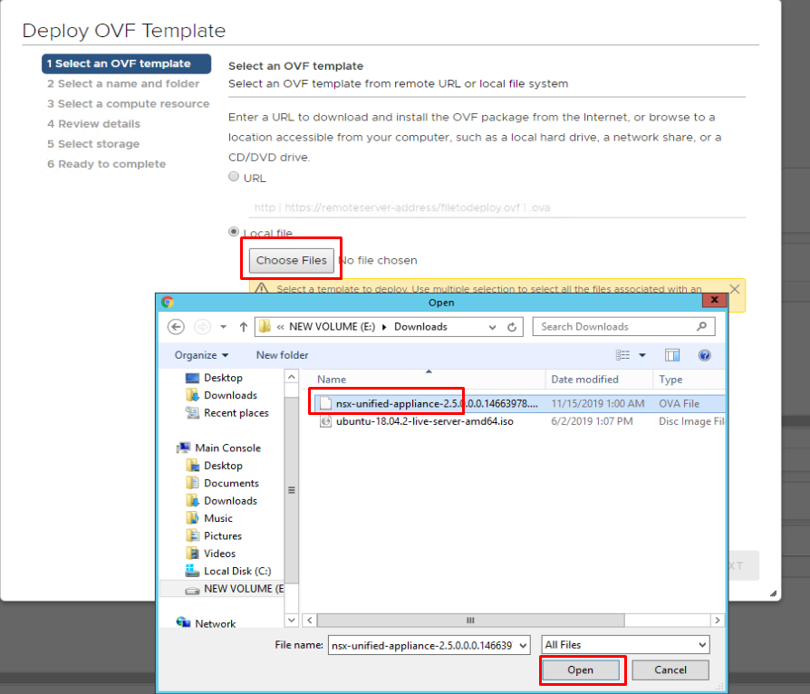
</details>

#### 1.3 On the `Select a name and folder` step, use the name `nsxmgr01a-1` and select `RegionA01` Datacenter as the location

<details><summary>Screenshot 1.3</summary>

</details>

#### 1.4 On the `Select a compute resource` step, select `RegionA01-MGMT01` and click `Next`

<details><summary>Screenshot 1.4</summary>
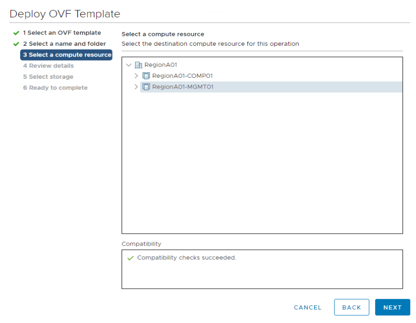
</details>

#### 1.5 On the `Review Details` step, verify details and click `Next`

<details><summary>Screenshot 1.5</summary>

</details>

#### 1.6 On the `Configuration` step, select a `Small` Configuration and click `Next`

<details><summary>Screenshot 1.6</summary>
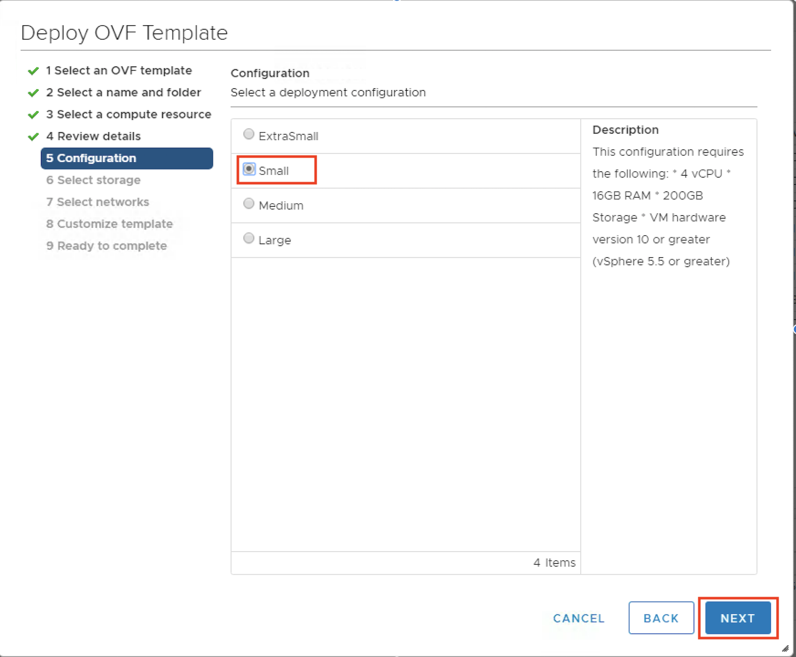
</details>

#### 1.7 On the `Select Storage` step, **first** select the `RegionA01-ISCSI02-COMP01` datastore and then set the virtual disk format to `Thin Provision`.

Note: When you select the datastore, the UI resets the value for the virtual disk format back to thick provision, so its best to select the datastore first and then set the virtual disk format.

<details><summary>Screenshot 1.7</summary>
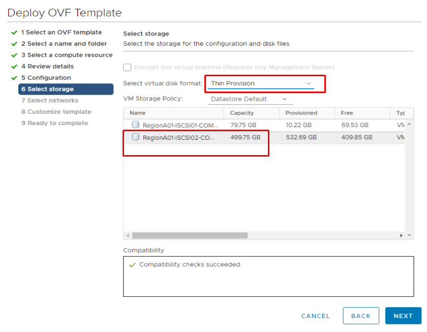
</details>

#### 1.8 On the `Select Networks` step, set the Destination Network to `VM-RegionA01-vDS-MGMT` and click `Next`

<details><summary>Screenshot 1.8</summary>
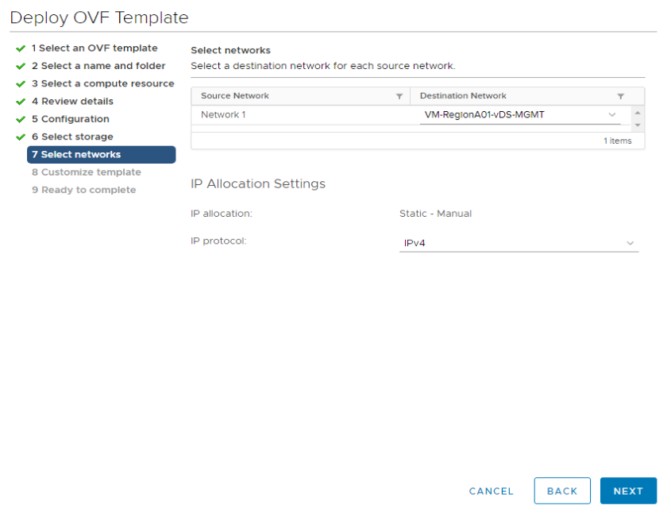
</details>

#### 1.9 On the `Customize Template` step, enter the following variables:

- Application
  - System Root User Password: VMware1!VMware1!
  - CLI Admin User Password: VMware1!VMware1!
  - CLI Audit User Password: VMware1!VMware1!
- Network Properties
  - Hostname: nsxmgr01a-1
  - Rolename: NSX Manager
  - Default Gateway: 192.168.110.1
  - Management Network IPv4 Address: 192.168.110.31
  - Management Network Netmask: 255.255.255.0
- DNS
  - DNS Server List: 192.168.110.10
  - Domain Search List: corp.local
- Services Configuration
  - NTP Server: 192.168.100.1
  - Enable SSH: True
  - Allow Root SSH Logins: True
- All other options were left as default values

<details><summary>Screenshot 1.9</summary>
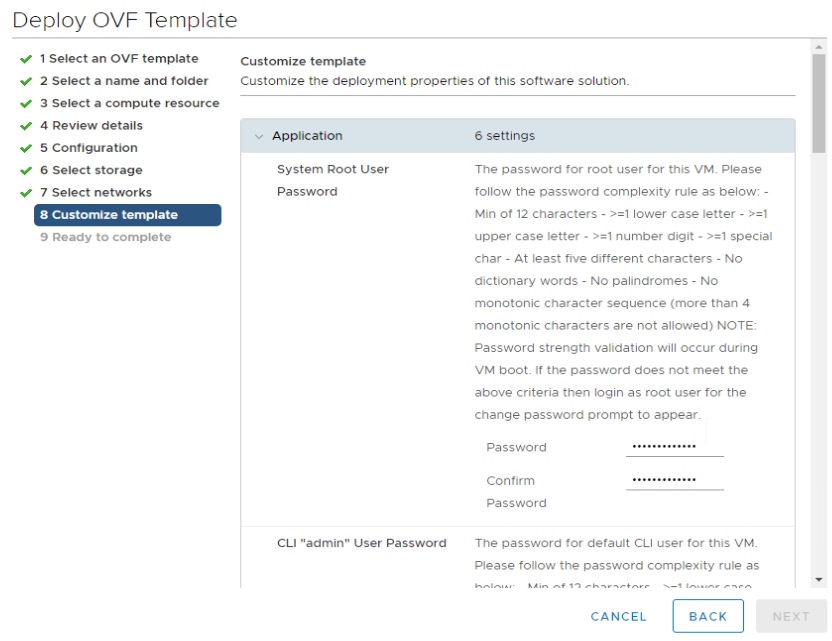
</details>

#### 1.10 On the Ready to Complete screen, click `Finish` to complete the Deploy OVF Template Wizard

<details><summary>Screenshot 1.10</summary>
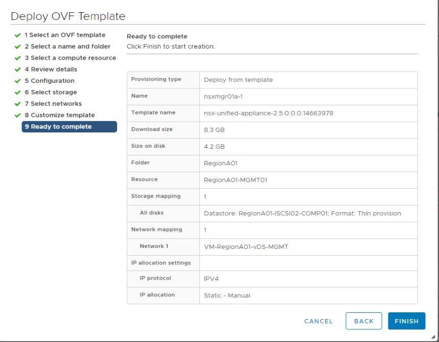
</details>

#### 1.11 In the vSphere web client go to the task console and verify that the Status for Deploy OVF Template is "Completed" before proceeding

<details><summary>Screenshot 1.11</summary>

</details>

#### 1.12 In the vSphere web client power on the nsxmgr01a-1 VM, you can proceed to the next step while waiting for NSX Manager to boot up

NOTE: If the option to power on the nsxmgr-01a VM is not available, log out and then log back in to the vSphere web client

<details><summary>Screenshot 1.12</summary>
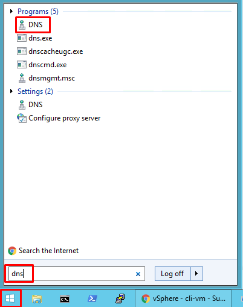
</details>

#### 1.13 From the control center desktop, click the windows start button, in the search field type `DNS` and click on `DNS` as shown in the screenshot below

<details><summary>Screenshot 1.13/summary>
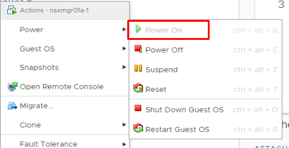
</details>

#### 1.14 In DNS Manager, in the navigation tree, expand `ControlCenter.corp.local`, then expand `Forward Lookup Zones`, left click to select `corp.local`, and then right click on `corp.local` and select `New Host (A or AAAA)...`

<details><summary>Screenshot 1.14</summary>
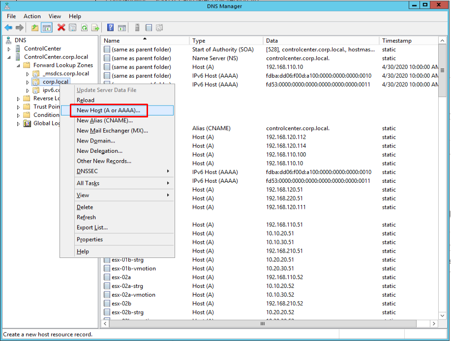
</details>

#### 1.15 In the `New Host` window, enter the following values:

- Name: `nsxmgr01a-1`
- IP Address: `192.168.110.31`
- Click `Add Host`
- Close the `New Host` window
- Close `DNS Manager`

This configures the labs DNS server to resolve the hostname you configured for NSX Manager (`nsxmgr01a-1`) to resolve to the IP address you assigned (`192.168.110.31`)

<details><summary>Screenshot 1.15</summary>
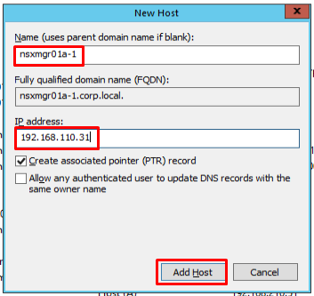
</details>

#### 1.16 Open a web browser connection to NSX Manager, for example:

[https://nsxmgr01a-1.corp.local/login.jsp](https://nsxmgr01a-1.corp.local/login.jsp)

If the page does not load, you may need to wait a few minutes for NSX Manager to complete booting up

You should see a page that says `Your connection is not private`, select `Advanced`, and click `Proceed to nsxmgr01a-1.corp.local`. At any point if you see this screen again in later steps in this lab guide, follow the same steps here to bypass the `Your connection is not private` message. 

Login to the NSX Manager UI:

- User: admin
- Password: VMware1!VMware1!

_NOTE: On your first login, you will be prompted to accept the EULA. Accept EULA and opt out of VMware Customer Experience program._

<details><summary>Screenshot 1.16</summary>

</details>

#### 1.17 In the NSX Manager UI, click on a blank area of the screen to bypass the `Welcome to NSX-T` splash screen,  navigate to `System > Appliances`. Observe the value for `Virtual IP` is not set, click `Edit`, set the Virtual IP address to `192.168.110.42` and click `Save`

The virtual IP address provides a single ip address that can be used to connect to a cluster of NSX manager appliances providing high availability. Because the lab environment is highly oversubscribed, you will only create a single nsx manager appliance, however the steps in this guide still assign a virtual IP address to configure NSX-T as you would when using clustered NSX Manager nodes.

<details><summary>Screenshot 1.17.1</summary>
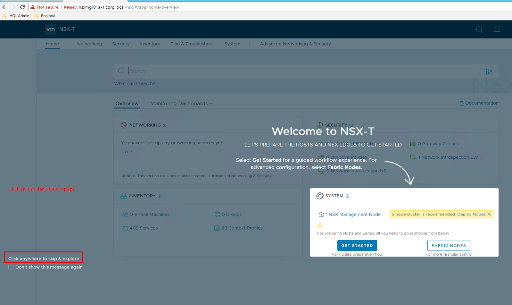
</details>

<details><summary>Screenshot 1.17.2</summary>
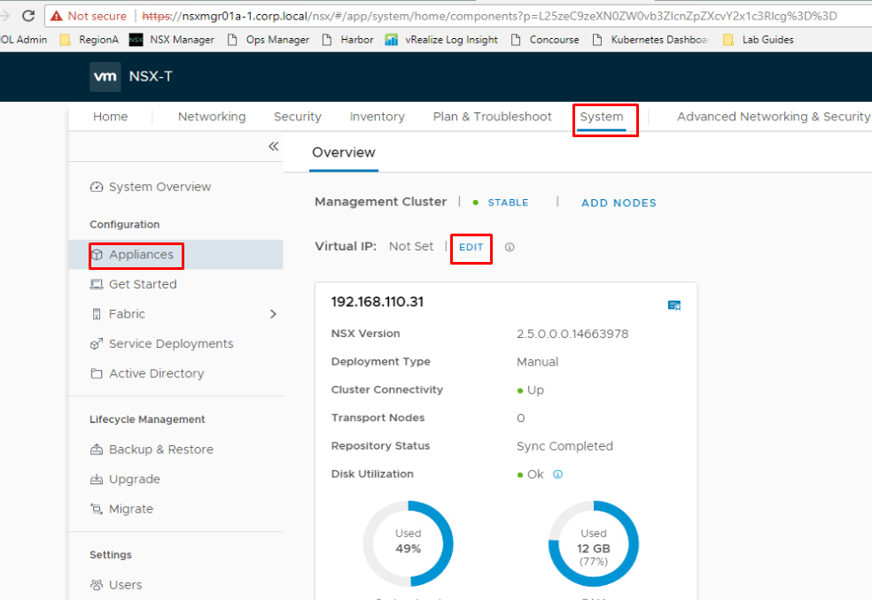
</details>

<details><summary>Screenshot 1.17.3</summary>
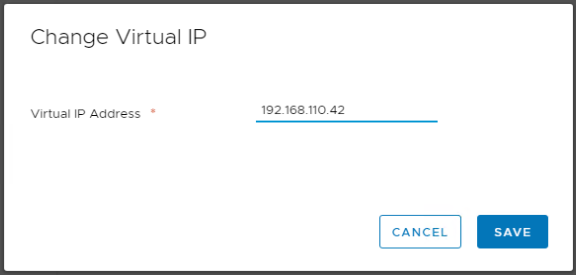
</details>

<details><summary>Screenshot 1.17.4</summary>
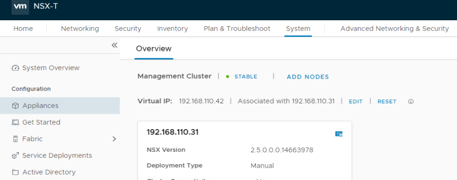
</details>


#### 1.18 In your web browser tab connected to NSX-T Manager, change the URL to [https://nsxmgr-01a.corp.local/login.jsp](https://nsxmgr-01a.corp.local/login.jsp) and reconnect to NSX Manager using this new URL. 

The URL `nsxmgr-01a.corp.local` is pre-configured in the lab environment to resolve to `192.168.110.42` in the labs DNS server. Note that this `192.168.110.42` is the same IP address that you assigned as the NSX Manager Virtual IP address in the last step. By changing your URL and reconnecting to NSX Manager, you validate that the Virtual IP address is functioning as intended. 

Going forward unless otherwise noted, you should use the NSX-T Manager virtual IP address or its associated hostname `nsxmgr-01a.corp.local` both when you connect to NSX manager, or when you configure any machine-to-machine connections for NSX Manager. 

<details><summary>Screenshot 1.18</summary>
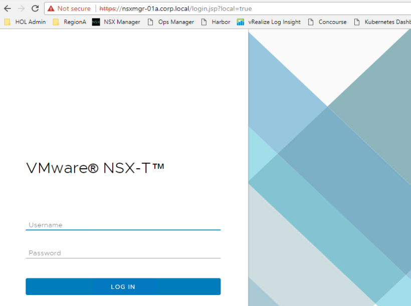
</details>

## Step 2: Add NSX Compute Manager

In this step, you create a connection between the NSX manager and your vCenter. This enables NSX manager to deploy [VIBs required for esx host preparation for nsx-t](https://docs.pivotal.io/pks/1-7/nsxt-install-prep-esxi-hosts.html) to the hosts, controller and edge VMs.

#### 2.1 In your web browser connection to NSX-T Manager, click on the `System` tab and then on the left navigation bar Click `Fabric`, and then click `Compute Managers`

<details><summary>Screenshot 2.1</summary>

</details>

#### 2.2 Click on **Add** and Configure the New Compute Manager form with following values:

- Name: `vcsa-01a`
- Domain Name/IP Address: `vcsa-01a.corp.local`
- Type: `vCenter`
- Username: `administrator@corp.local`
- Password: `VMware1!`
- Clcik **Add**
- Click **Add** again to accept the vCenter certificate thumbprint

_NOTE: in a production implementation, you should first copy the vCenter thumbprint and then provide it in the form to properly authenticate the intial connection._

<details><summary>Screenshot 2.2.1</summary>
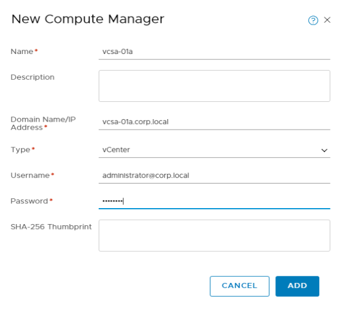
</details>

<details><summary>Screenshot 2.2.2</summary>

</details>

#### 2.3 Verify the Compute Manager is `Registered` and `Up`. If needed, click **Refresh** in the lower-left hand corner to refresh the display.

<details><summary>Screenshot 2.3.1</summary>
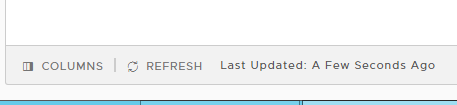
</details>

<details><summary>Screenshot 2.3.2</summary>
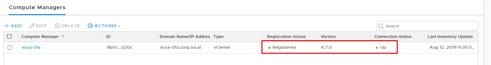
</details>

## Step 3: Add an Edge Node, Transport Zones and Uplink Profiles with the NSX-T Guided Preparation Workflow

#### 3.1 From the NSX-T Manager UI navigate to the `Advanced Networking & Security > Inventory > Groups > IP Pools` page and click `+ADD` 

<details><summary>Screenshot 3.1</summary>
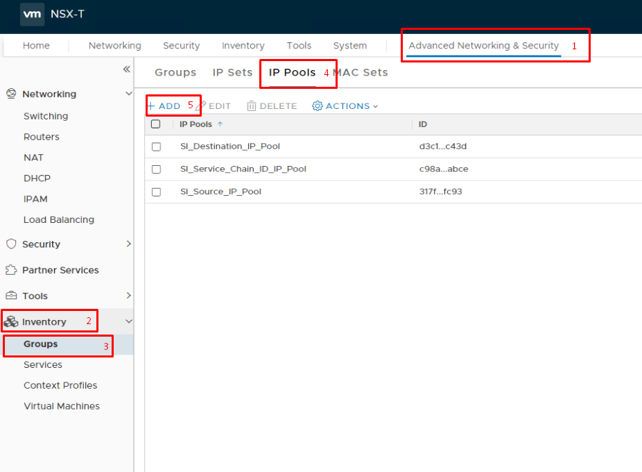
</details>

#### 3.2 On the `Add IP Pool` screen, enter the following values:

- Name: `tep-ip-pool`
- Click `Add` under Subnets
- IP Range: `192.168.130.51-192.168.130.75`
- Gateway: `192.168.130.1`
- CIDR: `192.168.130.0/24`
- DNS Servers:  `192.168.110.10`
- DNS Suffix: `Corp.local`
- Click **Add**

<details><summary>Screenshot 3.2</summary>

</details>

#### 3.3 From NSX-T Manager UI, click on the `System` tab, then click `Get Started` in the left navigation bar, and then click `Setup Transport Nodes`

<details><summary>Screenshot 3.3</summary>
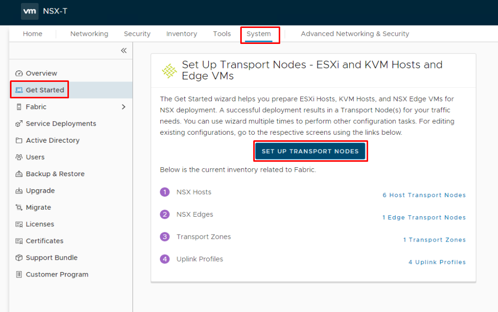
</details>

#### 3.4 On the `Select Node Type` screen, select `NSX Edge VM` and click `Next`

<details><summary>Screenshot 3.4</summary>
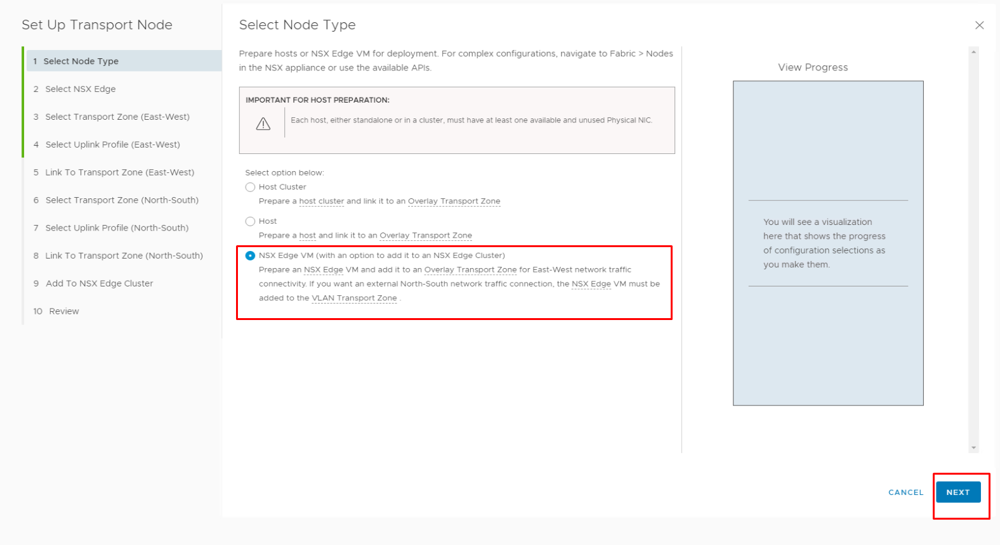
</details>

#### 3.5 On the `Select NSX Edge` Screen, click `Add New Edge`

<details><summary>Screenshot 3.5</summary>
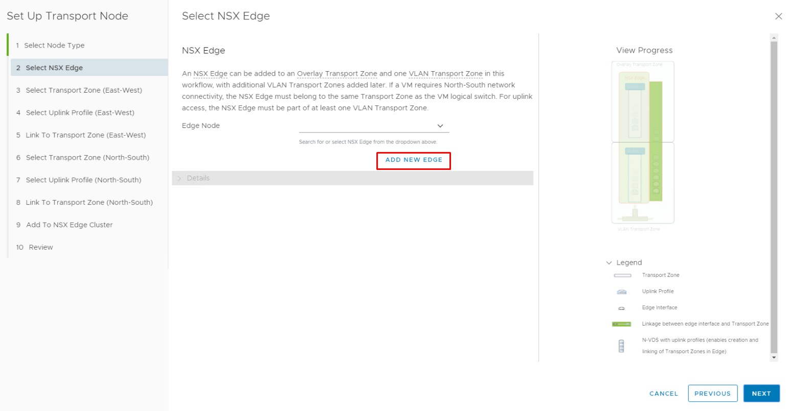
</details>

#### 3.6 Complete the Add Edge VM workflow with the following values:

 - Name: nsxedge-1
 - FQDN: nsxedge-1.corp.local   
 - Form Factor: Large
 - Click Next
 - CLI Password: VMware1!VMware1!
 - Allow SSH Login: `True`
 - System Root Password: VMware1!VMware1!
 - Allow Root SSH Login: `True`
 - Click Next
 - Compute Manager: vcsa-01a
 - Cluster: RegionA01-MGMT01
 - Resource Pool: Leave Blank
 - Host: Leave Blank
 - Datastore: RegionA01-ISCSI02-COMP01
 - Click Next
 - Management: VM-RegionA01-vDS-MGMT
 - Select "Static" (not DHCP)
 - Management IP: 192.168.110.91/24
 - Gateway IP: 192.168.110.1
 - fp-eth0: Uplink-RegionA01-vDS-MGMT
 - fp-eth1: Transport-RegionA01-vDS-MGMT
 - fp-eth2: VM-RegionA01-vDS-MGMT
 - Search Domain Names: corp.local
 - DNS Servers: 192.168.110.10
 - NTP Servers: 192.168.100.1
 - Click Finish

<details><summary>Screenshot 3.6.1</summary>
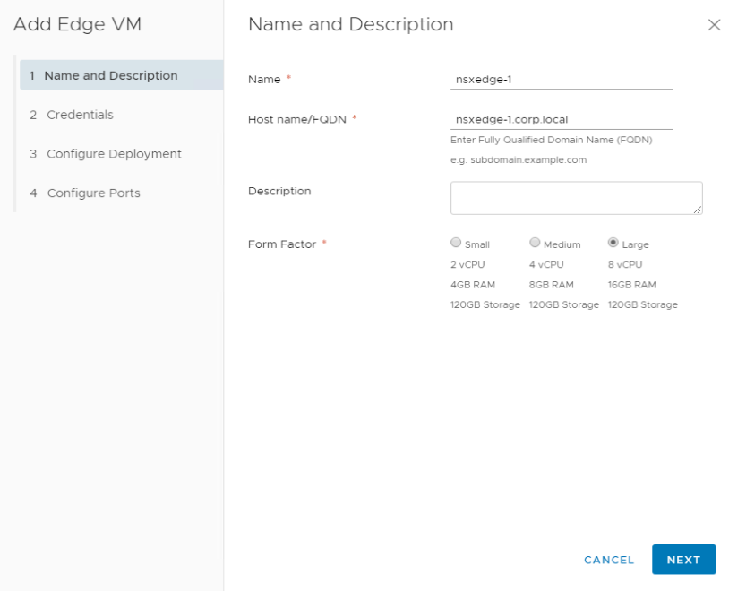
</details>

<details><summary>Screenshot 3.6.2</summary>
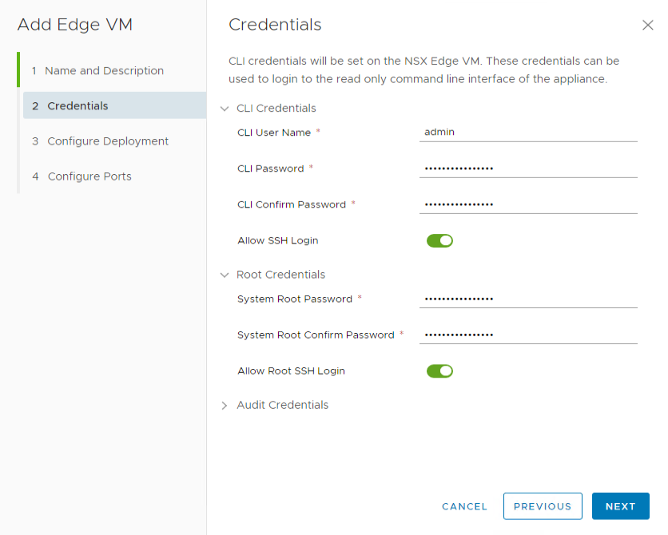
</details>

<details><summary>Screenshot 3.6.3</summary>
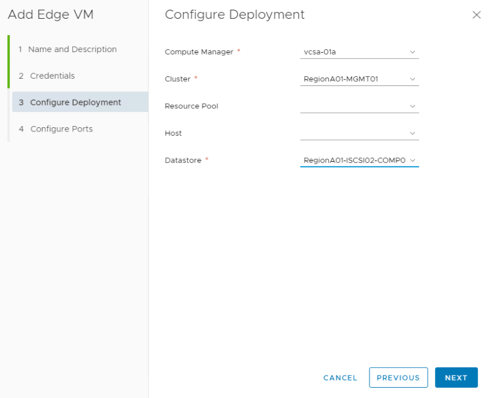
</details>

<details><summary>Screenshot 3.6.4</summary>
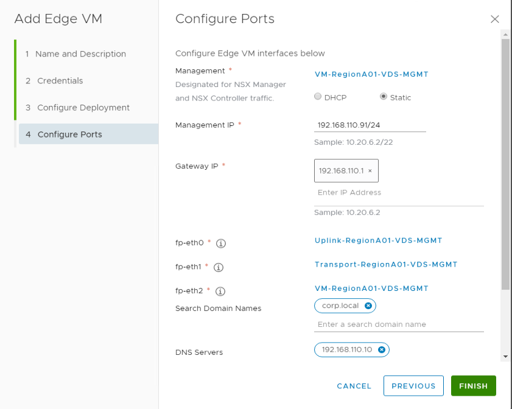
</details>

#### 3.7 The Wizard will deploy and attempt to power on the edge VM (This will take several minutes), but it will fail as there is no host with the capacity to run the large edge in the lab. 

Note: In this step, you will make an unsupported configuration change to the NSX Edge VM to accomodate the limitations of the oversubcribed lab environment. This step should NEVER be done in a production environment as it will invalidate your support contract and could cause serious problems in a production or production testing environment. 
 
Log into the vCenter web ui, review the tasks pane to check the status of the edge VM deployment and ensure the edge VM is finished deploying, wait as needed, and verify you can see the error message in the `Recent Tasks` pane indicating that vCenter could not power on the edge vm. 

Navigate to the `Hosts and Clusters` view, select `nsxedge-1`. From the actions menu for `nsxedge-1` select `Edit Settings`.

Set the CPU count to `4`, then expand the `Memory` section, **uncheck** the box for `Reserve all guest memory (All Locked)`, set the `Reservation` value to `0 MB` and click `OK`

<details><summary>Screenshot 3.7.1</summary>
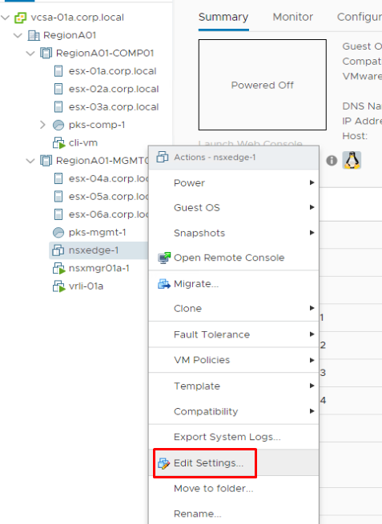
</details>

<details><summary>Screenshot 3.7.2</summary>
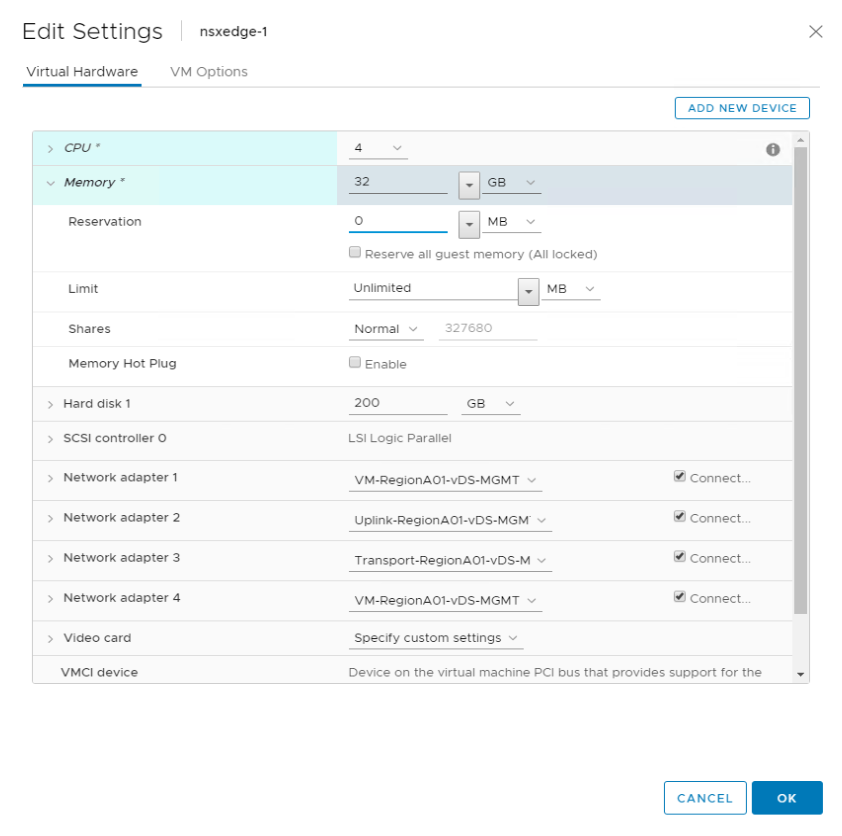
</details>
<br/>

After making the changes to the `nsxedge-1` VM, right click the `nsxedge-1` vm and select `Power On`

#### 3.8 Return to the NSX UI and wait for the wizard to recognize the NSX Edge VM. This may take up to ~15 minutes, and you may need to refresh your connection to NSX Manager, if so you can use the same steps as above to get back to the `Setup Transport Nodes ` wizard. 
 
 On the `Select NSX Edge` screen select `nsxedge-1` from the `Edge Node` Pulldown Menu, ensure the `Deployment Status` is `Node Ready`,  and click `Next` 

<details><summary>Screenshot 3.8</summary>
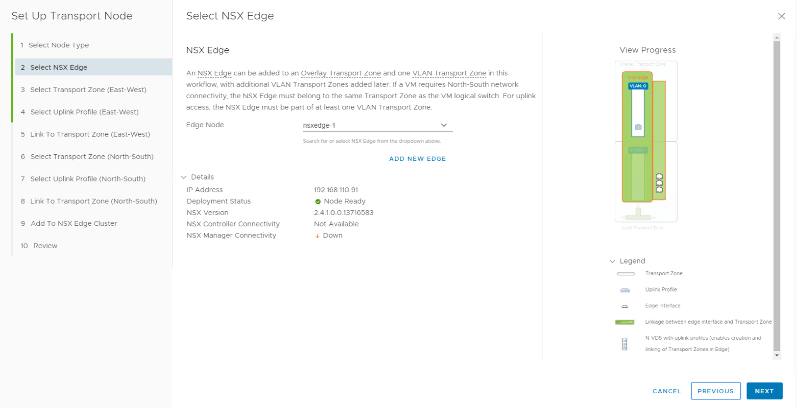
</details>

#### 3.9 On the `Select Transport Zone East-West` Screen, select `Create Overlay Transport Zone`

<details><summary>Screenshot 3.9</summary>
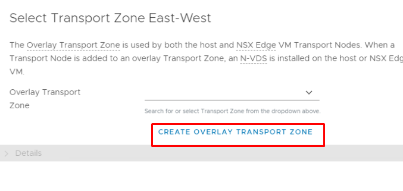
</details>

#### 3.10 In the `Add Transport Zone` workflow, enter the following values:

- Name: `overlay-tz`
- N-VDS Name: `hostswitch-overlay`
- Traffic Type: `Overlay`
- Click **Add** 

<details><summary>Screenshot 3.10</summary>
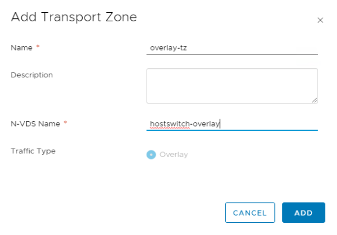
</details>

#### 3.11 On the `Select Transport Zone East-West` screen, select `overlay-tz` from the `Overlay Transport Zone` pulldown menu and click `Next` 

<details><summary>Screenshot 3.11</summary>
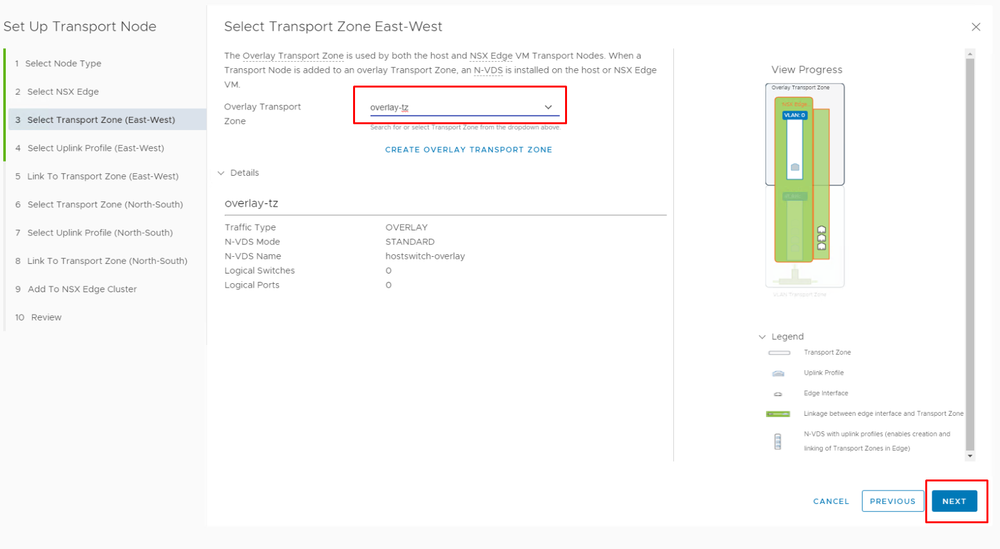
</details>
<br/>

#### 3.12 On the `Select Uplink Profile East-West` screen, click the `Select Uplink Profile` pulldown menu and select the `nsx-edge-single-nic-uplink-profile` and click `Next`

<details><summary>Screenshot 3.12</summary>
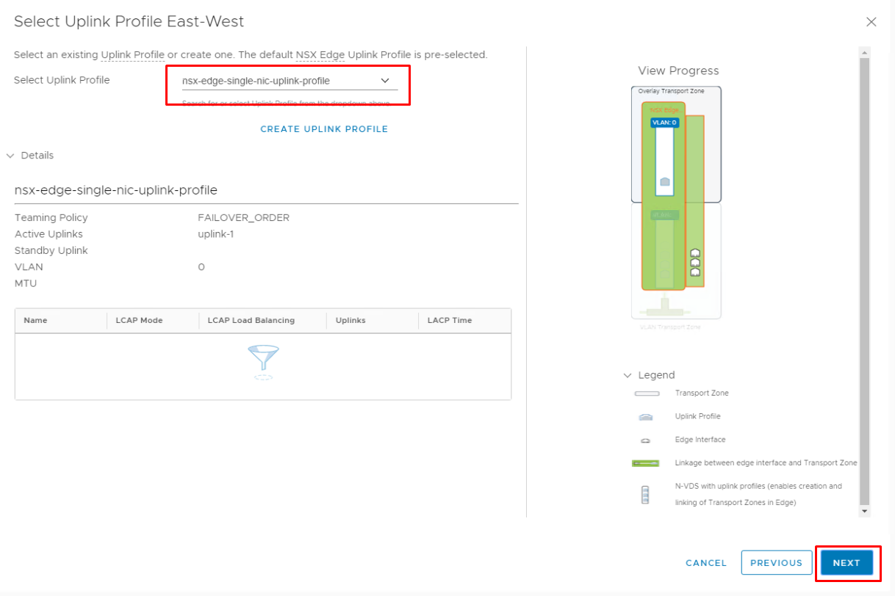
</details>

#### 3.13 On the `Link to Transport Zone East-West` screen for `Assignment IP Address` select `Use IP Pool` and select `tep-ip-pool` and proceed to the next step before clicking next

<details><summary>Screenshot 3.13</summary>
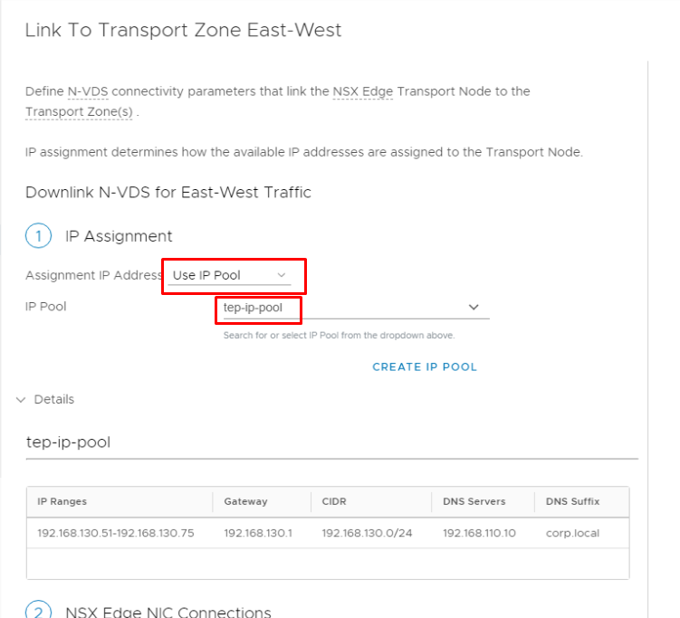
</details>

#### 3.14 On the `Link to Transport Zone East-West` screen in the `NSX Edge NIC Connections` section, set the value for `fp-eth1` to `uplink-1` and click `Next`

<details><summary>Screenshot 3.14</summary>
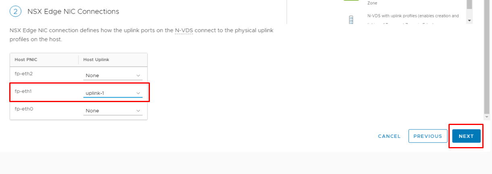
</details>

#### 3.15 On the `Select Transport Zone North-South` screen, click `Create VLAN Transport Zone`

<details><summary>Screenshot 3.15</summary>
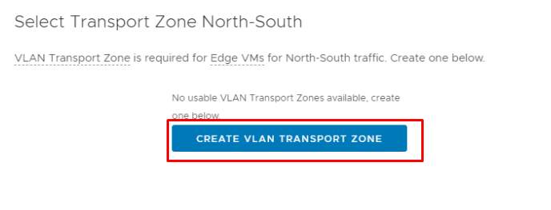
</details>

#### 3.16 On the `Add Transport Zone` screen, add a transport zone with the following parameters:

 - Name: vlan-tz
 - N-VDS Name: hostswitch-vlan
 - Traffic Type: VLAN
 - Click **Add**

<details><summary>Screenshot 3.16</summary>
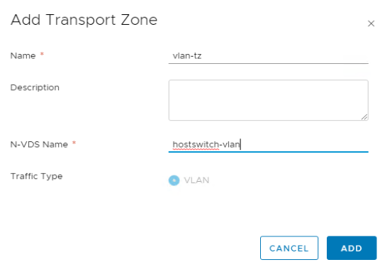
</details>

#### 3.17 On the `Select Transport Zone North-South` screen, select `vlan-tz` from the pulldown menu for `VLAN Transport Zone` and click `Next`

<details><summary>Screenshot 3.17</summary>
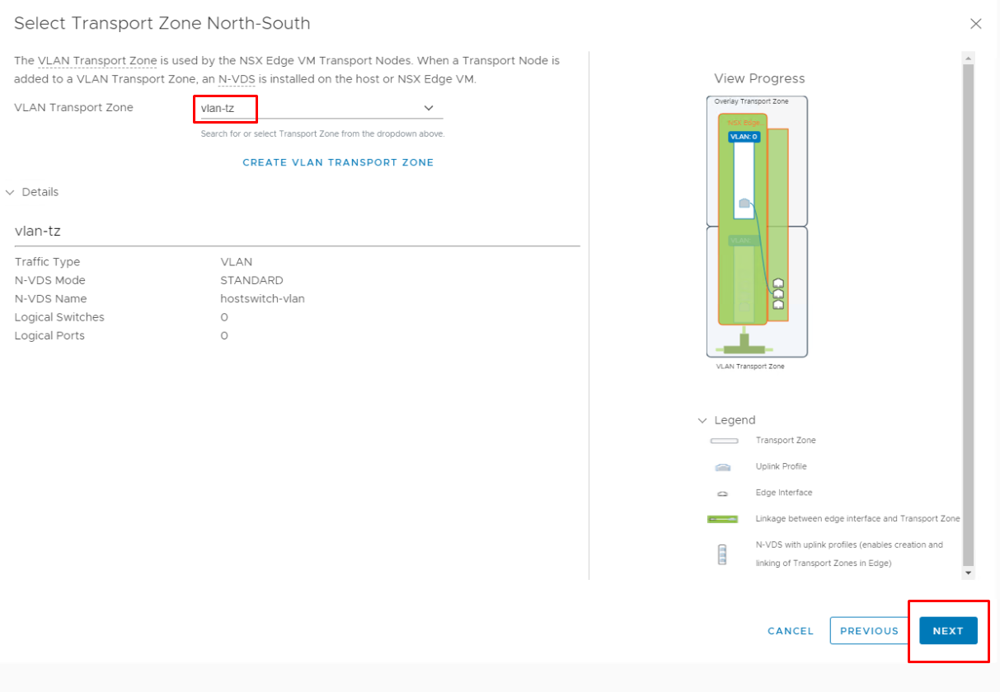
</details>
<br/>

#### 3.18 On the `Select Uplink Profile North-South` screen, select `nsx-edge-single-nic-uplink-profile` from the `Select Uplink Profile` pulldown menu and click `Next`

<details><summary>Screenshot 3.18</summary>
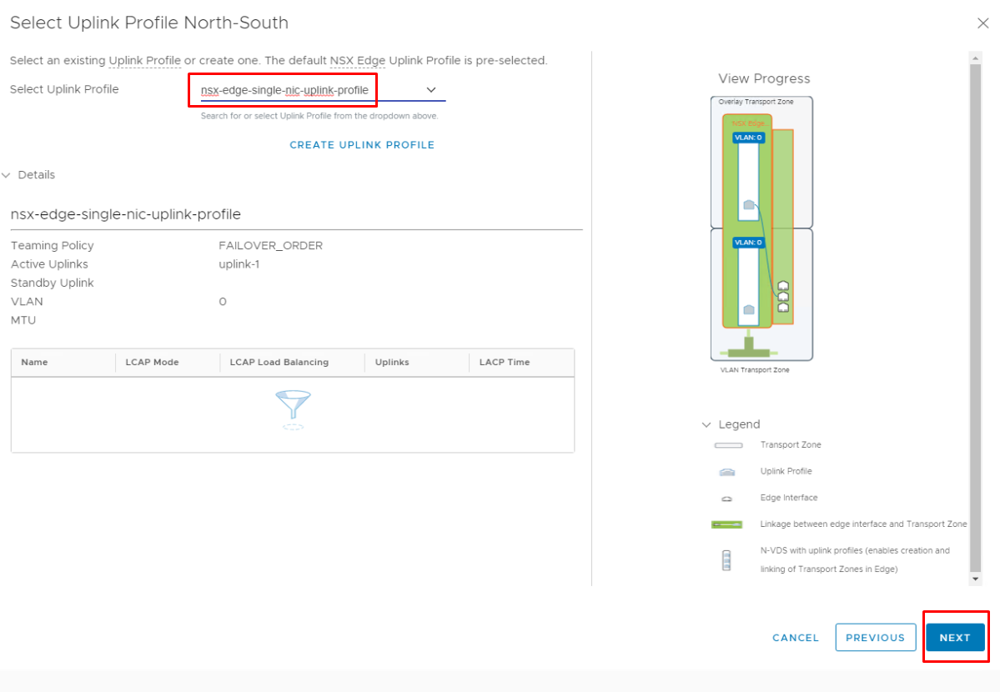
</details>

#### 3.19 On the `Link To Transport Zone North-South` screen, in the `NSX Edge NIC Connections` section, set the value for `fp-eth0` to `uplink-1` and click `Next`

<details><summary>Screenshot 3.19</summary>
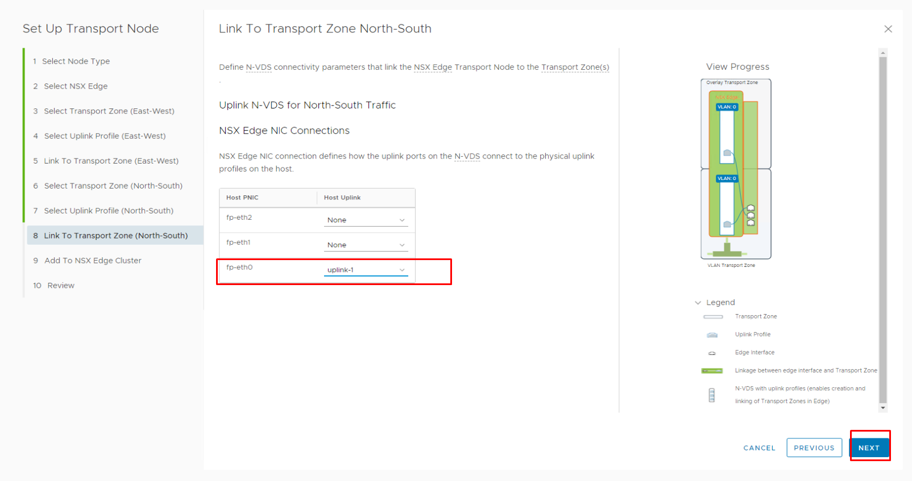
</details>

#### 3.20 On the `Add To NSX Edge Cluster` screen, select `Add To New NSX Edge Cluster (system created)` field, set the `NSX Edge Cluster Name` value to `edge-cluster-1` and click `Next`

<details><summary>Screenshot 3.20</summary>
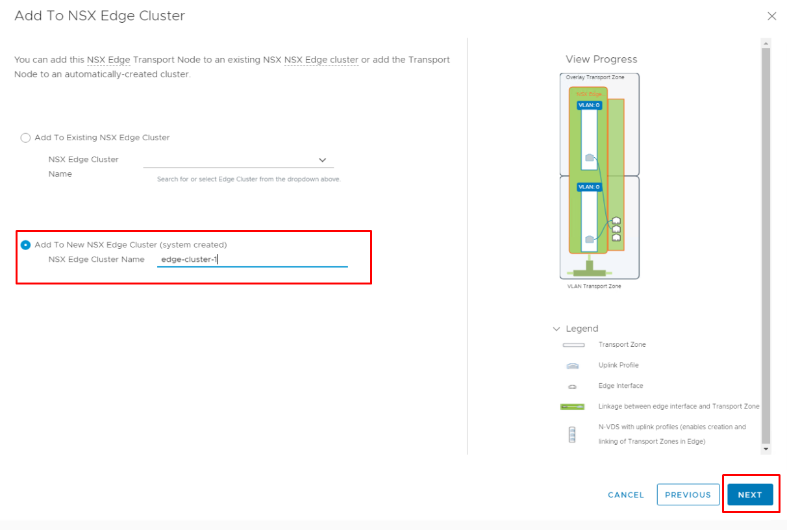
</details>

#### 3.21 On the `Review` screen, set the `Transport Node Name` to `edge-tn-1` and click `Finish`

<details><summary>Screenshot 3.21</summary>
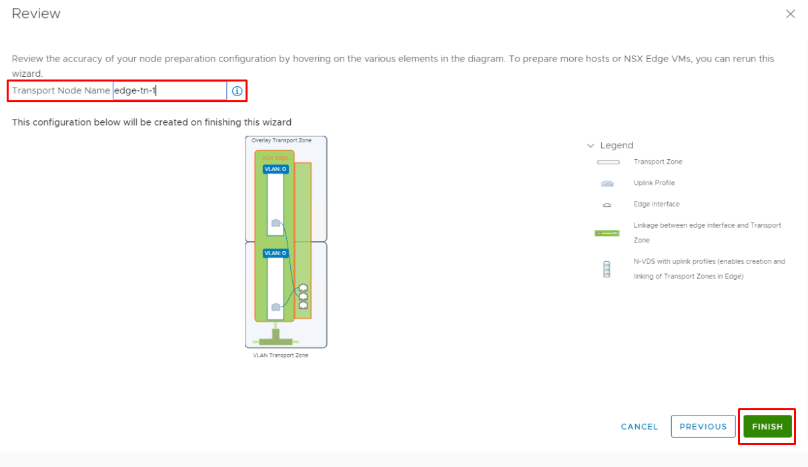
</details>

#### 3.22 On the `System` tab in NSX Manager UI, In the left navigation bar expand the `Fabric` section and select `Nodes`. Select the `Edge Transport Nodes` tab, verify that `edge-tn-1` has a `Configuration State` of `Success`, a `Node Status` of `Up`, and is a member of `edge-cluster-1`

<details><summary>Screenshot 3.22</summary>
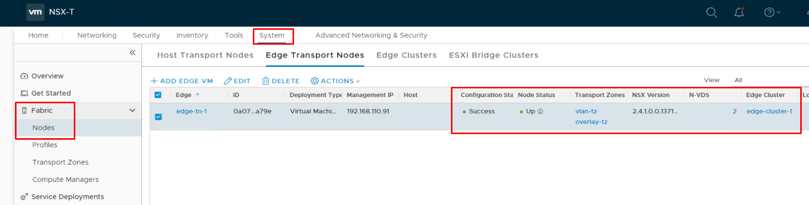
</details>

#### 3.23 From the control center desktop, click the windows start button, in the search field type `DNS` and click on `DNS` as shown in the screenshot below

<details><summary>Screenshot 3.23</summary>

</details>

#### 3.24 In DNS Manager, in the navigation tree, expand `ControlCenter.corp.local`, then expand `Forward Lookup Zones`, left click to select `corp.local`, and then right click on `corp.local` and select `New Host (A or AAAA)...`

<details><summary>Screenshot 3.24</summary>

</details>

#### 3.25 In the `New Host` window, enter the following values:

- Name: `nsxedge-1`
- IP Address: `192.168.110.91`
- Click `Add Host`
- Close the `New Host` window
- Close `DNS Manager`

This configures the labs DNS server to resolve the hostname you configured for the NSX Edge (`nsxedge-1`) to resolve to the IP address you assigned (`192.168.110.91`)

<details><summary>Screenshot 3.25</summary>

</details>

## Step 4: Prepare and Configure ESXi Hosts as NSX-T Transport Nodes

To prepare hosts for NSX-T,  NSX-T Manager will deploy and install NSX VIBs (i.e.kernel modues), configure the NSX tunnel endpoints, which enables host participation in the N-VDS overlay fabric.

Reference: [https://docs.pivotal.io/pks/1-7/nsxt-install-prep-esxi-hosts.html](https://docs.pivotal.io/pks/1-7/nsxt-install-prep-esxi-hosts.html)

#### 4.1 From the NSX Manager UI go to the `System > Get Started` page and click `SET UP TRANSPORT NODES` 

<details><summary>Screenshot 4.1</summary>

</details>
<br/>

#### 4.2 On the `Select Node Type` screen select `Host Cluster` and click `Next`

<details><summary>Screenshot 4.2</summary>
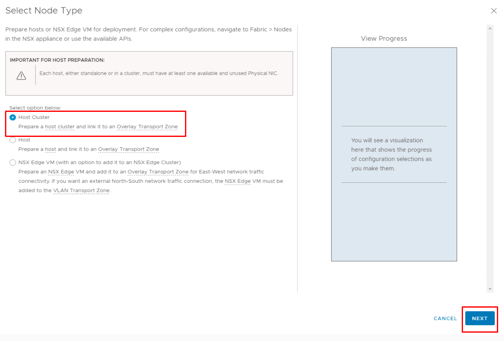
</details>


#### 4.3 On the `Select Host Cluster` Screen, set the value for `Host Cluster` to `RegionA01-COMP01`, when you make this selection, the page will prompt you to `Confirm Installation`, click `Install`. Do not proceed until the status in the `NSX` column for `esx-01a`, `esx-02a` and `esx-03a` is `NSX Installed`, and that `NSX Manager Connectivity` is `Up` for each host as shown in the screenshots below.

<details><summary>Screenshot 4.3.1</summary>
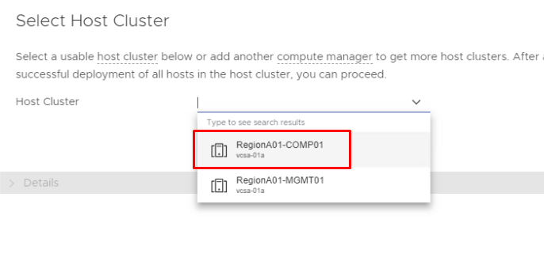
</details>

<details><summary>Screenshot 4.3.2</summary>
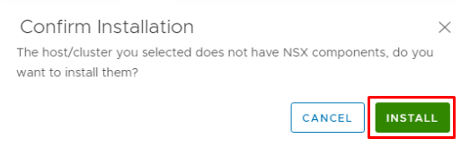
</details>

<details><summary>Screenshot 4.3.3</summary>
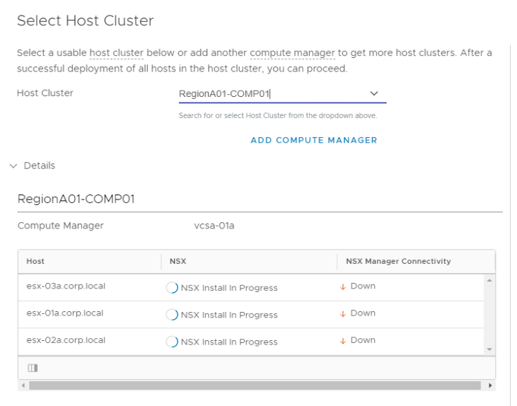
</details>

<details><summary>Screenshot 4.3.4</summary>
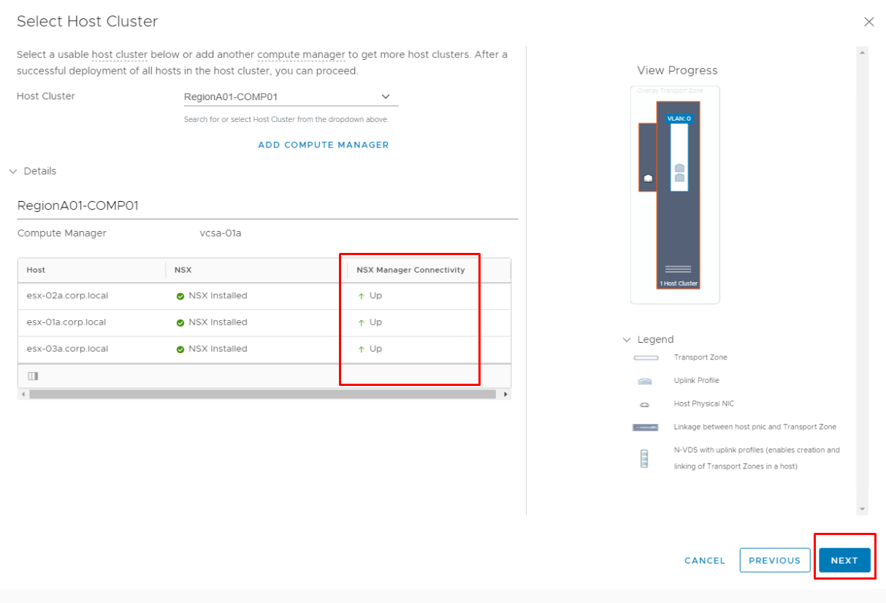
</details>
<br>

#### 4.4 On the `Select Transport Zone East-West` screen set the value for `Overlay Transport Zone` to `overlay-tz` and click `Next`

<details><summary>Screenshot 4.4</summary>
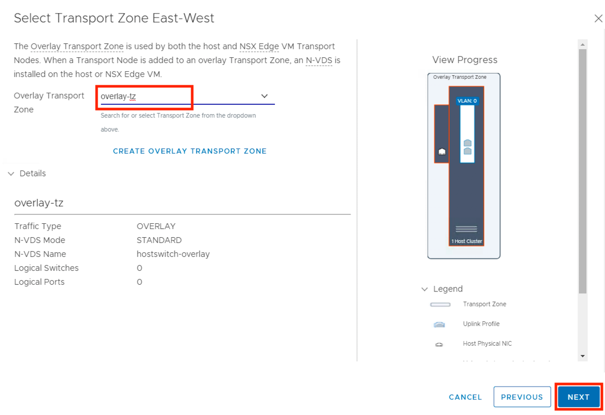
</details>


#### 4.5 On the `Select Uplink Profile East-West` screen, set the value for `Select Uplink Profile` to `nsx-default-uplink-hostswitch-profile` and click `Next`

<details><summary>Screenshot 4.5</summary>
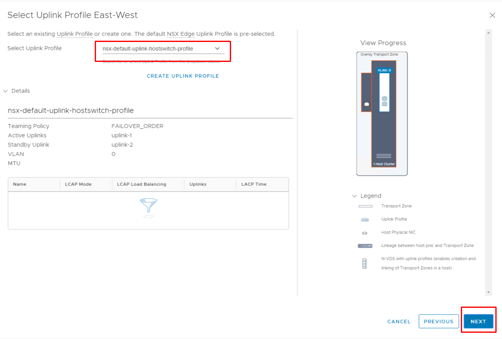
</details>


#### 4.6 On the `Link to Transport Zone East-West` screen, set the value for `Assignment IP Address` to `Use IP Pool` and set the value for `IP Pool` to `tep-ip-pool`, proceed to the next step before clicking next

<details><summary>Screenshot 4.6</summary>
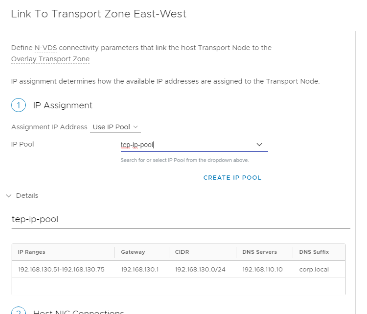
</details>


#### 4.7 On the `Link to Transport Zone East-West` screen, in the `Host NIC Connections` section, set the value for `vmnic1` to `uplink-1` and click `Next`

<details><summary>Screenshot 4.7</summary>
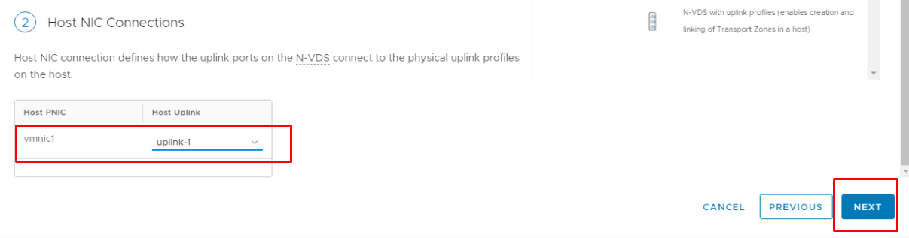
</details>


#### 4.8 On the `Review` screen, click `Finish`

<details><summary>Screenshot 4.8</summary>
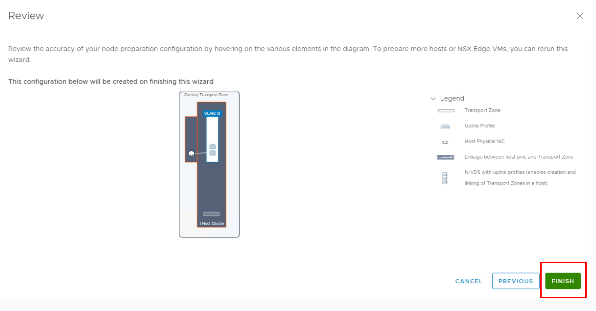
</details>


#### 4.9 From the NSX Manager UI go to the `System > Get Started` page and click `SET UP TRANSPORT NODES` 

<details><summary>Screenshot 4.9</summary>

</details>


#### 4.10 On the `Select Node Type` screen select `Host Cluster` and click `Next`

<details><summary>Screenshot 4.10</summary>

</details>


#### 4.11 On the `Select Host Cluster` Screen, set the value for `Host Cluster` to `RegionA01-MGMT01`, when you make this selection, the page will prompt you to `Confirm Installation`, click `Install`. Do not proceed until the status in the `NSX` column for `esx-04a`, `esx-05a` and `esx-06a` is `NSX Installed`, and that `NSX Manager Connectivity` is `Up` for each host as shown in the screenshots below.

<details><summary>Screenshot 4.11.1</summary>
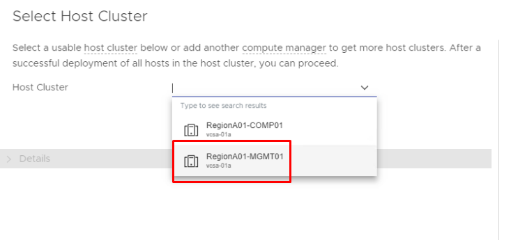
</details>

<details><summary>Screenshot 4.11.2</summary>

</details>

<details><summary>Screenshot 4.11.3</summary>
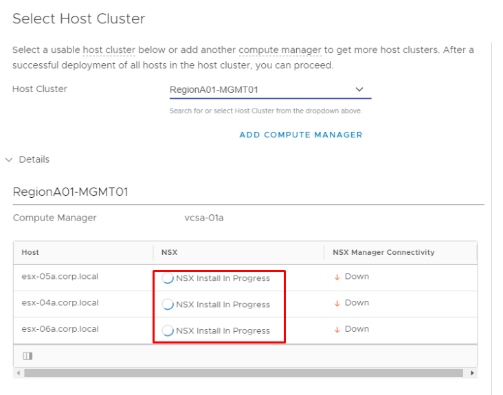
</details>

<details><summary>Screenshot 4.11.4</summary>
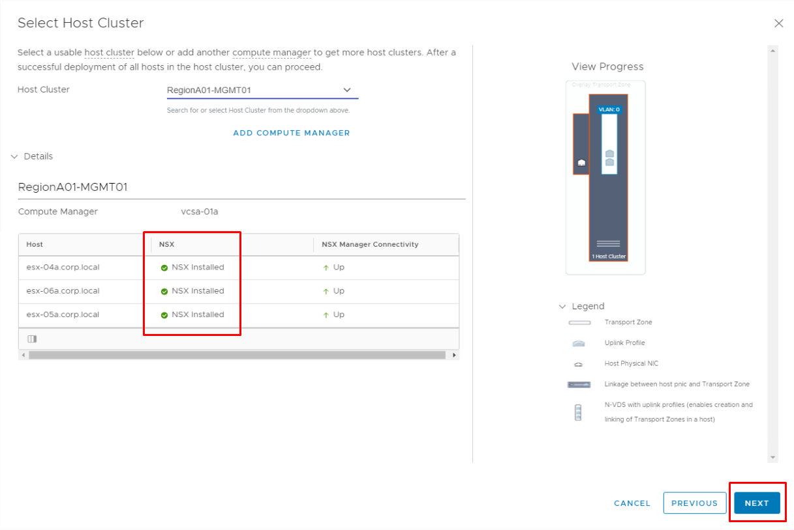
</details>
<br>

#### 4.12 On the `Select Transport Zone East-West` screen set the value for `Overlay Transport Zone` to `overlay-tz` and click `Next`

<details><summary>Screenshot 4.12</summary>
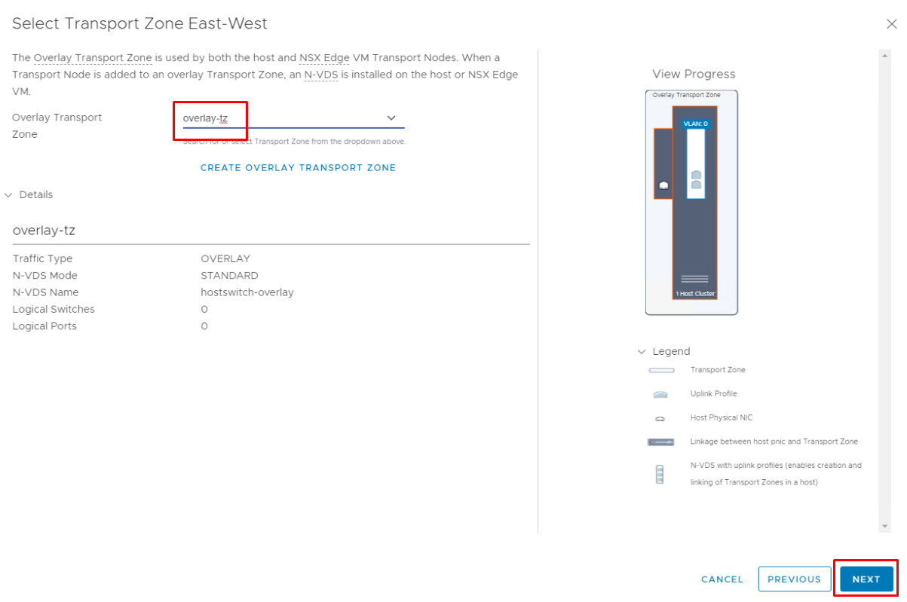
</details>


#### 4.13 On the `Select Uplink Profile East-West` screen, set the value for `Select Uplink Profile` to `nsx-default-uplink-hostswitch-profile` and click `Next`

<details><summary>Screenshot 4.13</summary>
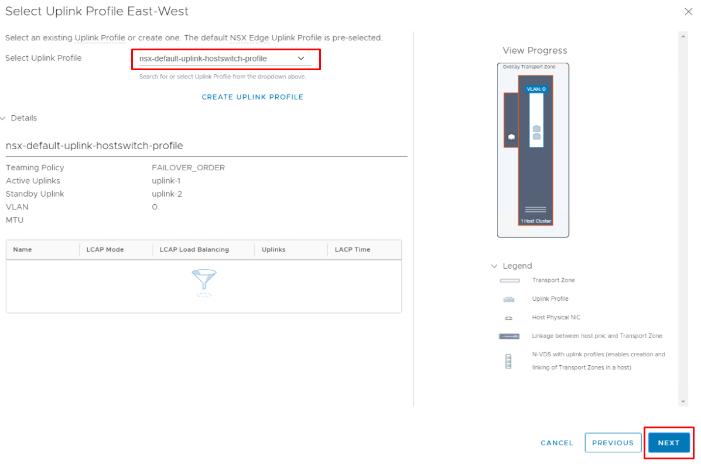
</details>


#### 4.14 On the `Link to Transport Zone East-West` screen, set the value for `Assignment IP Address` to `Use IP Pool` and set the value for `IP Pool` to `tep-ip-pool`

<details><summary>Screenshot 4.14</summary>

</details>


#### 4.15 On the `Link to Transport Zone East-West` screen, in the `Host NIC Connections` section, set the value for `vmnic1` to `uplink-1` and click `Next`

<details><summary>Screenshot 4.15</summary>

</details>


#### 4.16 On the `Review` screen, click `Finish`

<details><summary>Screenshot 4.16</summary>

</details>


#### 4.17 On the `System` tab in NSX Manager UI, In the left navigation bar expand the `Fabric` section and select `Nodes`. Select the `Host Transport Nodes` tab, set the `Managed by` field to `vcsa-01a`, expand the `RegionA01-MGMT01` and `RegionA01-COMP01` sections and ensure the `Configuration State` is `Success` and the `Node Status` is `Up` for all of the hosts

<details><summary>Screenshot 4.17</summary>
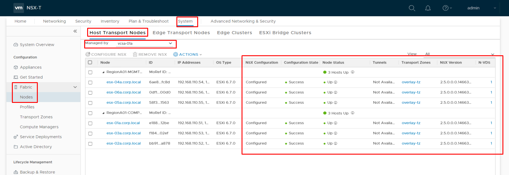
</details>


## Step 5: Optionally configure NSX Licensing & Password Expiration

By default NSX-T Data Center 2.5.1 will run for 60 days on an evaluation license, and user passwords will expire 90 days after last change. If you intend to run your environment longer than 60/90 days, you will need to add a valid license, and may prefer to extend password expiration. 

#### 5.1 In the NSX-T UI, navigate to `System > Licenses` and click `+ADD`

<details><summary>Screenshot 5.1</summary>
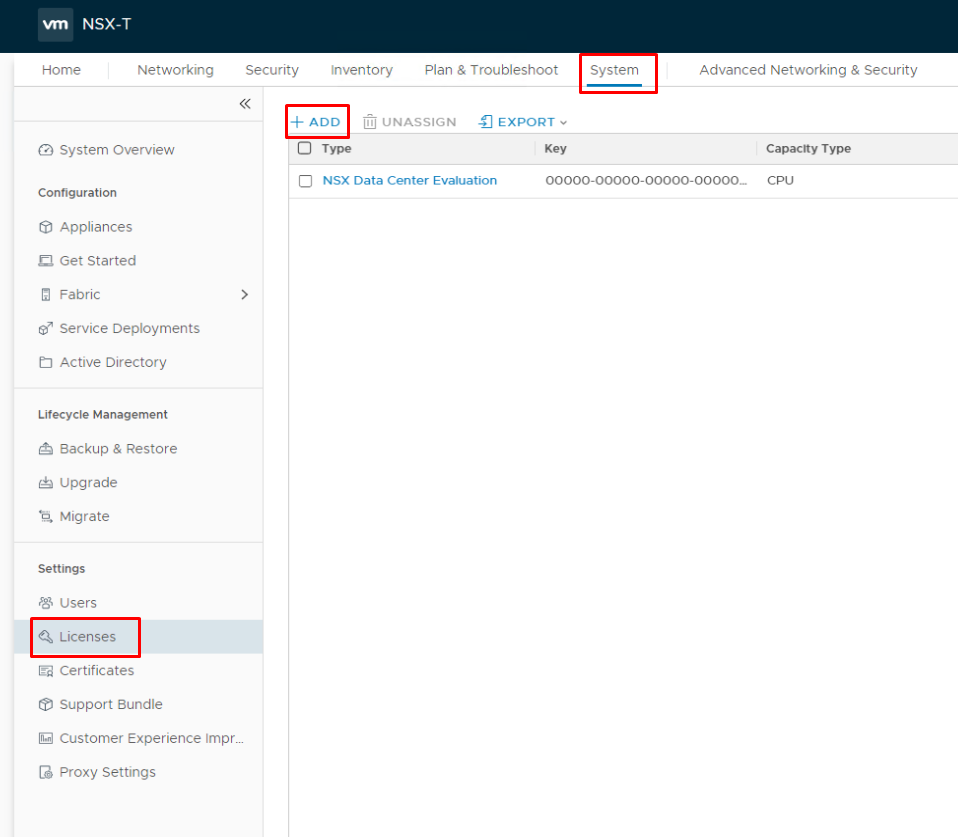
</details>

#### 5.2 Enter your license key and click `ADD`

<details><summary>Screenshot 5.2</summary>
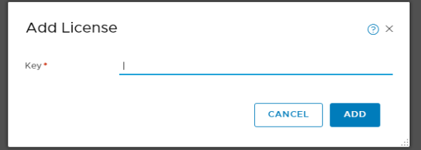
</details>

#### 5.3 From the control center desktop open putty and establish an ssh connection to nsxmgr-01a, login as `root` with the password `VMware1!VMware1!, and enter the following commands:

Note: In this step, you will set the password expiration to 9999 days, which is highly insecure and should never be done in a production environment.

```bash
su admin
get user root password-expiration
set user root password-expiration 9999
set user admin password-expiration 9999
set user audit password-expiration 9999
# Now confirm one or all the users:
get user root password-expiration
# All done !
exit
```

<details><summary>Screenshot 5.3</summary>
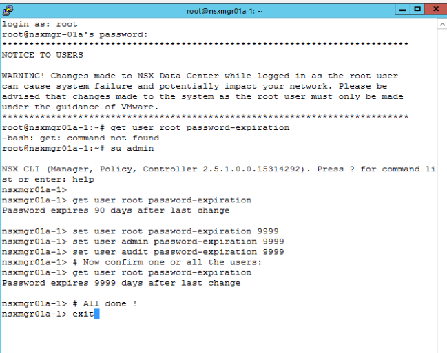
</details>


**You have now completed the Base NSX-T installation**

***End of lab***
